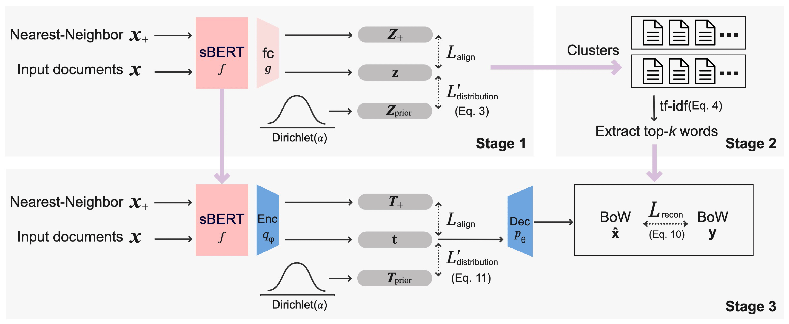

# Unified Neural Topic Model via Contrastive Learning and Term Weighting (EACL2023)

## Requirements
- Python 3.7
- PyTorch 1.8.0
- transformers 4.19.0
- numpy 1.21.4
- scipy 1.7.1
- pandas 1.3.4
- umap-learn 0.5.2
- scikit-learn 0.24.2
- sentence-transformers 2.2.0

Code is not tested with other versions.

## Data
You can add your own data by refering to the data class in `data.py`. The data should be in the format of a list of documents, where each document is a string.

## Usage
`ContrastiveTM-main.ipynb` is the main notebook for training and evaluating the model.

## TODO
- [ ] Modularize the code
- [ ] Make it into an installable package
- [ ] Test on different Python/PyTorch versions

## Acknowledgements
Some parts of the implementation is based on the code from [contextualized-topic-models](https://github.com/MilaNLProc/contextualized-topic-models).
